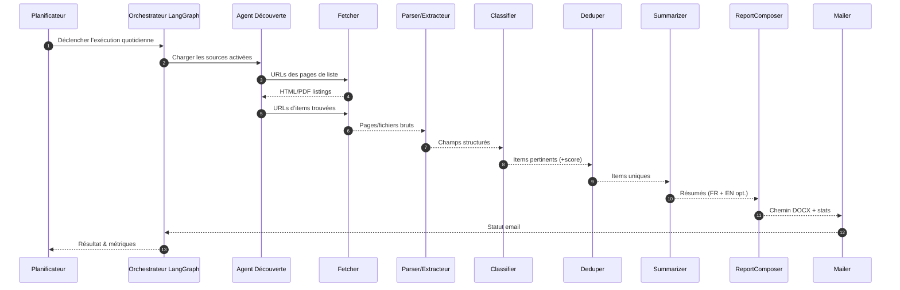

# 1) Présentation du projet
**Nom du projet :** YULCOM BF – Système autonome de veille des Appels d’Offres IT/Ingénierie (Burkina Faso)

**Propriétaire :** YULCOM Technologies Burkina Faso  
**Préparé pour :** Direction / CTO / Équipe Delivery  
**Date :** 01 novembre 2025  
**Fuseau horaire :** Afrique/Ouagadougou

**But :** Concevoir un système multi‑agents (LangChain + LangGraph + Gradio) capable de rechercher automatiquement chaque jour les appels d’offres (RFP/AO) dans le domaine IT/ingénierie au Burkina Faso, de filtrer et résumer les résultats, de les compiler dans un rapport **.docx** et de l’envoyer par email à des destinataires configurables.

---

# 2) Objectifs & critères de succès
**Objectifs principaux**
1. Découvrir quotidiennement de nouvelles opportunités (AO/RFP) à partir de sources publiques fiables au Burkina Faso.  
2. Classer et filtrer automatiquement les avis pertinents pour l’IT/ingénierie (logiciel, réseaux, cloud, cybersécurité, data/IA, intégration, support, équipements, etc.).  
3. Extraire les champs clés, générer des résumés FR, puis produire un rapport Word homogène.  
4. Envoyer automatiquement le rapport par email à heure fixe, avec une interface Gradio pour supervision et relance manuelle.

**Critères d’acceptation (tests de recette)**
- **Rappel ≥ 90 %** des AO pertinents sur un échantillon de 2 semaines (après réglage).  
- **Faux positifs ≤ 10 %** après calibration règles+modèle.  
- Rapport généré **chaque jour à 07:30** (paramétrable) et délivré à tous les destinataires.  
- **Temps de bout‑en‑bout ≤ 15 min** en conditions normales.  
- Fonction **« Re‑run »** et **override manuel** via le dashboard.

---

# 3) Périmètre
**Inclus (Phase 1)**
- Crawling/open‑web de sources publiques burkinabè (AO/RFP).  
- Extraction HTML/PDF, OCR FR, normalisation dates/devises/localités.  
- Classification pertinence IT/ingénierie (hybride règles+ML).  
- Résumés FR.  
- Dé‑duplication inter‑sources et traçabilité/provenance.  
- Génération d’un rapport **.docx** quotidien + envoi SMTP.  
- Interface Gradio (sources, historiques, validations, destinataires).  
- Déploiement Docker Compose sur VPS YULCOM.

**Hors périmètre (Phase 1)**
- Achat de dossiers, élaboration d’offres, scoring CRM.  
- Portails protégés sans identifiants fournis.  
- Multilingue complet au‑delà FR/EN (abstract court).

---

# 4) Parties prenantes & rôles
- **Sponsor / Product Owner :** YULCOM Burkina (Direction).  
- **Tech Lead :** Abdoul‑Aziz ZOROM (CTO).  
- **IA/Data Ops :** Ingénieur(e) NLP/ML.  
- **DevOps :** Ingénieur(e) plateforme (VPS/Docker/Sécu).  
- **Utilisateurs finaux :** Développement commercial, Bid Managers, Chefs de projet.

---

# 5) Sources cibles (Phase 1)
> Les URL concrètes sont paramétrées dans l’application (extensibles via Gradio).

- **Portails nationaux** de commande publique (pages AO/DAO).  
- **Sites ministériels** publiant des avis (Économie/Finances, autorités sectorielles).  
- **Agrégateurs spécialisés** couvrant le Burkina Faso.  
- **Bailleurs/organisations** (UE, ONU, etc.) diffusant des appels locaux.

Chaque source comporte : nom, base URL, URL(s) de listage, sélecteurs (CSS/XPath/regex), type (HTML/PDF), limites de débit, indicateur activé, hash « last‑seen ».

---

# 6) Exigences fonctionnelles
## 6.1 Découverte & fetching quotidiens
- **Planificateur** déclenche le graphe LangGraph à l’heure configurée (par défaut 07:00).  
- **Agent Découverte** parcourt les sources actives et détecte les nouvelles URL.  
- **Agent Fetcher** télécharge HTML/PDF (cache, ETag, backoff).  
- **Conformité robots/ToS** : respect robots.txt, throttling par domaine.

## 6.2 Parsing & extraction
- **HTML** : sélecteurs CSS/XPath (titre, réf., entité, dates, budget, liens, contacts).  
- **PDF** : pdfminer.six ; **OCR** Docling pour PDF image‑seul.  
- **Normalisation** : dates FR → ISO, devise → XOF, géographie → région/province.  
- **Métadonnées** : URL source, checksum, horodatage, id d’exécution (run).

## 6.3 Classification (pertinence IT/Ingénierie)
- **Approche hybride** :  
  1) **Règles** (familles de mots‑clés : informatique, logiciel, réseau, fibre, cybersécurité, cloud, data, IA, SIG, serveur, switch, infogérance, maintenance, hébergement, web/mobile, ERP, etc.).  
  2) **Modèle FR** (CamemBERT/DistilCamemBERT) fine‑tuned binaire (PERTINENT vs NON).  
- **Score de confiance** avec seuil ajustable.

## 6.4 Déduplication & chaînage
- **Empreintes** de contenu (SimHash/MinHash) + clés normalisées (titre/date/entité).  
- Fusion des doublons ; conservation de la **provenance multi‑URLs**.

## 6.5 Résumés & points saillants
- Résumé **FR (5–8 lignes)** : **Objet**, **Entité**, **Budget (si présent)**, **Éligibilité**, **Pièces clés**, **Dépôt/Échéance**, **Contacts**.  
- Normalisation **date limite** + **jours restants**.

## 6.6 Génération du rapport (.docx)
- **Page de garde** (logo YULCOM, date, « RFP Watch – Burkina Faso »).  
- **Résumé exécutif** : statistiques (# sources scannées, # pertinents, évolution J‑1).  
- **Table des matières** automatique.  
- **Fiches AO** : Titre, Entité, Réf., Catégorie (Biens/Services/Travaux), Dates (pub/limite), Localisation, Budget, URL(s) source, Résumé, Liste des pièces.  
- **Annexes** : couverture des sources, erreurs de crawl, notes de rate‑limit.  
- Nom de fichier : `RFP_Watch_BF_YYYY-MM-DD-HH-MM.docx`.

## 6.7 Distribution par email
- Relais **SMTP** (domaine YULCOM) ou Gmail/Workspace.  
- **Objet** : `RFP Watch – Burkina Faso – <YYYY‑MM‑DD-HH-MM>`.  
- **Corps (FR)** : synthèse courte, compteurs, top 3, lien dashboard, pièce jointe .docx.  
- Gestion des **destinataires** dans Gradio (groupes To/Cc/Bcc).

## 6.8 Tableau de bord Gradio
- **Statut** : heure/temps du dernier run, compteurs, erreurs.  
- **Sources** : ajout/édition/suppression, test de fetch, activation, limites de débit.  
- **Validation** : échantillon des cas borderline pour apprentissage.  
- **Rapports** : aperçu/chargement du dernier rapport, téléchargement.  
- **Destinataires** : gestion des emails et groupes.  
- **Actions** : **Run Now**, **Rebuild Report**.

## 6.9 Auditabilité & provenance
- Persistance des **runs**, **provenances par notice**, **transformations appliquées**.  
- Snapshots (HTML/PDF) conservés **≥ 30 jours** (paramétrable).  
- Chaque fiche du rapport pointe vers l’**URL source**.

---

# 7) Exigences non fonctionnelles
- **Disponibilité** : tolérance aux pannes transitoires ; retries avec backoff.  
- **Performance** : crawl ≤ 50 pages/min (throttling) ; rapport ≤ 15 min/jour.  
- **Scalabilité** : ajout de sources sans code via Gradio ; fetchers parallèles futurs.  
- **Sécurité** : secrets via Docker secrets ; SMTP TLS ; images signées ; ACL sortantes minimales.  
- **Conformité** : conformité aux règles locales de commande publique.  
- **Observabilité** : logs structurés, métriques (runs, notices, erreurs), alerte en cas d’échec d’envoi.  
- **I18N** : FR prioritaire.

---

# 8) Architecture
## 8.1 Composants principaux
- **Orchestrateur LangGraph** : machine à états (nœuds/agents et transitions).  
- **Agents (outils LangChain)** : Fetcher, Parser, Classifier, Deduper, Summarizer, Composer, Mailer.  
- **Persistance** : PostgreSQL (métadonnées), **S3‑compatible (MinIO)** pour snapshots.  
- **Admin UI** : Gradio (auth).  
- **Planificateur** : APScheduler ou cron.

## 8.2 Modèle de données (relationnel)
- `sources(id, name, base_url, list_url, parser_type, rate_limit, enabled, last_seen_at)`  
- `runs(id, started_at, finished_at, status, counts_json, logs_url)`  
- `notices(id, source_id, title, ref_no, entity, category, published_at, deadline_at, location, budget_xof, currency, url, hash, relevance_score, is_relevant)`  
- `notice_urls(id, notice_id, url)`  
- `files(id, notice_id, kind, url, storage_key, checksum)`  
- `recipients(id, email, name, group)`

## 8.3 Flux LangGraph (simplifié)
```
[Start] → [LoadSources]
        → [FetchListings] → [ExtractItemLinks]
        → [FetchItems] → [Parse/Extract]
        → [Classify] → [Deduplicate]
        → [Summarize] → [ComposeReport]
        → [EmailReport] → [End]
            ↘ [Error/Retry Handler]
```

## 8.4 Séquence (Mermaid)


---

# 9) Pile technologique & bibliothèques
- **Runtime** : Python 3.11+  
- **Orchestration** : LangGraph  
- **Agents/Outils** : LangChain (Requests/Playwright, loaders)  
- **HTML/PDF** : Playwright ou httpx + selectolax/BeautifulSoup, pdfminer.six ; **Docling** pour OCR  
- **NLP (FR)** : spaCy `fr_core_news_md`, Transformers (CamemBERT), rapidfuzz  
- **Synthèse** : Groq Api, LLM OpenAI/compatible ou modèle local (configurable)  
- **Stockage** : PostgreSQL 18, MinIO (S3) 
- **Rapports** : python‑docx (template `.dotx`)  
- **Email** : SMTP (TLS), fallback Gmail API ; DKIM/SPF/DMARC  
- **UI** : Gradio 5 (auth), éventuellement thème Tailwind  
- **Planif.** : APScheduler/cron  
- **Packaging** : Docker, docker‑compose  
- **Observabilité** : structlog, Prometheus (metrics)

---

# 10) Intégration des sources (patterns)
Pour chaque source, définir un **pattern** :
- **Extracteur de listing** : sélecteurs pour blocs d’items ; pagination.  
- **Parser d’item** : mappage de champs (titre, réf., entité, dates, liens).  
- **Adaptateur PDF** : téléchargement → extraction texte → regex (« Date limite », « Délai de validité », « Lot », etc.).  
- **Normaliseur** : dates FR, devise/montant, toponymie (gazetteer).  
- **Règles** : mots‑clés include/exclude ; whitelists/blacklists d’organismes.

---

# 11) Configuration
- `CRON_SCHEDULE=0 7 * * *`  
- `MAIL_SMTP_HOST`, `MAIL_SMTP_USER`, `MAIL_SMTP_PASS`, `MAIL_FROM`, `MAIL_TO_GROUPS`  
- `DOCX_TEMPLATE_PATH`  
- `SOURCES_YAML` (monté en volume)  
- `OCR_ENABLED=true` (langue `fra`)  
- `GROQ_API_KEY` ou `OPENAI_API_KEY` ou provider équivalent  
- `RATE_LIMITS={"arcop.bf": "8/m", ...}`

Exemple `sources.yaml` :
```yaml
- name: ARCOP – Appels d’offres
  base_url: https://www.arcop.bf
  list_url: https://www.arcop.bf/appels-doffres/
  parser: html
  patterns:
    item_selector: article.post
    title: h2.entry-title a
    url: h2.entry-title a@href
    date: time.entry-date@datetime
  rate_limit: 6/m
  enabled: true

- name: DGCMEF – Quotidien des AO
  base_url: https://www.dgcmef.gov.bf
  list_url: https://www.dgcmef.gov.bf/fr/appels-d-offre
  parser: html-pdf-mixed
  patterns:
    pdf_links_selector: a[href$=".pdf"]
  rate_limit: 6/m
  enabled: true
```

---

# 12) Sécurité, légal & éthique
- Aucun accès non autorisé ; authentification gérée si fournie (Phase 2).  
- Secrets gérés via Docker secrets/Vault ; SMTP **TLS** ; rotation des credentials.  
- Conservation de la **provenance** pour audit.

---

# 13) Déploiement & DevOps
**Cible :** VPS YULCOM  
**Topologie :** 3 services applicatifs + 2 dépendances
- `orchestrator` (LangGraph + agents)  
- `ui` (Gradio)  
- `worker` (tâches lourdes PDF/OCR)  
- `postgres`, `minio`

**Docker Compose**
- Healthchecks, `restart: always`.  
- Volumes : cache modèles, MinIO, rapports, logs.  
- Reverse proxy Traefik/Nginx + basic auth pour l’UI.  
- Sauvegardes : `pg_dump` nocturne + snapshots MinIO off‑box.

**CI/CD**
- GitHub Actions : lint/tests → build images → push registry → déploiement SSH.  
- Tags d’images : `main-<sha>` ; variables via `.env` (sans secrets commit).  
- SAST (Bandit) + vérification licences.

---

# 14) Observabilité & exploitation
- **Métriques** : `notices_found`, `notices_relevant`, `emails_sent_ok`, `crawl_errors`, `parse_errors`, `time_to_report`.  
- **Alertes** : échec d’envoi ; zéro pertinent ; pics d’erreurs 5xx source.  
- **Journal de run** : JSON par exécution dans S3 ; lien depuis le dashboard.  
- **QA par échantillonnage** : 10 cas borderline à valider dans l’UI.

---

# 15) Stratégie de tests
- **Unitaires** : parsers, normaliseurs de dates, seuils du classifieur.  
- **Intégration** : E2E « dry‑run » avec fixtures enregistrées (VCRpy).  
- **Charge** : simulation 200 avis/jour, runtime < 15 min.  
- **UAT** : 2 semaines en parallèle d’un suivi manuel ; mesure précision/rappel ; tuning.

---

# 16) Risques & mitigations
- **Changements de structure** : parsers orientés config ; tests canari ; fallback OCR.  
- **Restrictions robots/ToS** : rate‑limits ajustables ; demandes d’autorisation ; cache.  
- **Dérive du modèle** : re‑labellisation périodique ; ré‑entraînement mensuel.  
- **Délivrabilité email** : SPF/DKIM/DMARC alignés ; PJ ≤ 10 Mo ; compression si besoin.  
- **Coût/temps OCR** : usage à la demande ; mise en file vers worker.

---

# 17) Plan de mise en œuvre
- **S1 – Fondations** : dépôt, Docker, schéma BD, `sources.yaml`, crawlers de base, stockage.  
- **S2 – Parsing/OCR & Classifieur v1** : extraction PDF/HTML, dates FR/devise, règles + modèle baseline.  
- **S3 – Résumés & Rapport** : prompts FR, template `.dotx`, styles Word, exemples.  
- **S4 – Orchestration & Email** : graphe, retries, SMTP, planification quotidienne.  
- **S5 – Gradio & UAT** : gestion sources, QA, destinataires, tests d’acceptation, go‑live.

---

# 18) Livrables
- Code source (licence interne).  
- Stack Docker Compose + `.env.example`.  
- UI Gradio.  
- Artefacts modèles & scripts de ré‑entraînement.  
- Modèle Word `.dotx` + rapports d’exemple.  
- Runbook Ops + tableau de bord métriques.

---

# 19) Annexes – Esquisses de prompts (illustratif)
**Résumé (FR)**  
- *Système* : « Tu es analyste en commande publique BF. Tu résumes des avis d’AO en français clair et concis, en mettant en évidence l’objet, l’entité, l’échéance, les pièces principales et les exigences de qualification. »  
- *Utilisateur* : « Texte OCR/HTML de l’avis … »  
- *Assistant* : « **Objet :** … **Entité :** … **Échéance :** … **Pièces :** … **Qualification :** … »

**Classifieur**  
- Labels zéro‑shot : {IT_ENG, NOT_IT}.  
- Boost mots‑clés : {logiciel, réseau, cybersécurité, cloud, serveurs, switch, fibre, data, IA, développement, maintenance informatique, ERP, SIG}.

---

# 20) Annexes – Gabarit DOCX
- **Page de titre** : logo YULCOM (en‑haut à droite), titre, date.  
- **Résumé exécutif** : KPIs, faits marquants.  
- **Carte d’avis** : Titre (Heading 2), grille meta (2 colonnes), résumé, puces de liens.  
- **Pied de page** : pagination + « YULCOM RFP Watch – Burkina Faso ».

---

# 21) Évolutions futures (Phase 2)
- Scoring/priorisation (fit, marge, historique).  
- Extension multi‑pays (UEMOA/CEDEAO).

